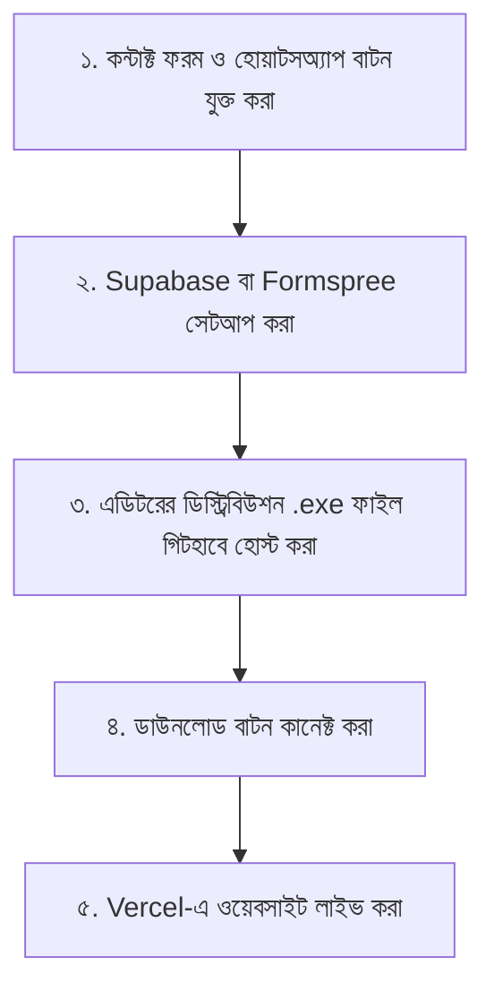

# Antigravity PDF Website - Launch & Integration Plan

এই ডকুমেন্টে আপনার পিডিএফ এডিটরের ওয়েবসাইটটি অনলাইনে সক্রিয় (Live) করার সম্পূর্ণ পরিকল্পনা এবং কীভাবে বিভিন্ন সিস্টেম (ডাউনলোড, কন্টাক্ট ফরম, হোয়াটসঅ্যাপ, ডাটাবেস) ফ্রিতে সেটআপ করবেন তার বিস্তারিত গাইড দেওয়া হলো।

---

## ১. ডোমেন ও হোস্টিং সমাধান (Domain & Hosting)

### ক) ডোমেন (Domain) কেনা কি বাধ্যতামূলক?
* **উত্তেজনাপূর্ণ খবর:** অনলাইনে সক্রিয় করার জন্য প্রথম দিকে ডোমেন কেনা **বাধ্যতামূলক নয়**। 
* আপনি **Vercel**-এ ফ্রিতে সাইট হোস্ট করলে তারা আপনাকে একটি ফ্রি সাবডোমেন দেবে (যেমন: `antigravity-pdf.vercel.app` বা `agpdf.vercel.app`)।
* **ভবিষ্যতের পরামর্শ:** যখন ব্যবসায়িকভাবে অ্যাপটি প্রচার করবেন, তখন একটি কাস্টম ডোমেন (যেমন: `antigravitypdf.com`) কিনে নেওয়া ভালো। এটি বছরে মাত্র $১০-$১২ (১,২০০ - ১,৫০০ টাকা) খরচ হবে (Namecheap বা Cloudflare থেকে কিনতে পারেন)। Vercel-এ এই কাস্টম ডোমেনটি ১ ক্লিকেই ফ্রিতে কানেক্ট করা যায়।

### খ) ফ্রি হোস্টিং (Free Hosting):
* **Vercel / Netlify:** আমাদের এই HTML ল্যান্ডিং পেজটি হোস্ট করার জন্য Vercel সম্পূর্ণ ফ্রি। কোনো হোস্টিং ফি বা মাসিক চার্জ লাগবে না।

---

## ২. ফাইল ডাউনলোড ও স্টোরেজ (Trial Download Setup)

"Download Free Trial" বাটনে ক্লিক করলে যেন সরাসরি অ্যাপের `.exe` ফাইল ডাউনলোড হয়, তার জন্য ফাইলটি কোনো ফ্রি ক্লাউড স্টোরেজে রাখতে হবে:

1. **GitHub Releases (সেরা ও সম্পূর্ণ ফ্রি):**
   * আপনার প্রজেক্টের গিটহাব রিপোজিটরিতে একটি "Release" তৈরি করে সেখানে `.exe` ফাইলটি আপলোড করে দিতে পারেন। এটি সম্পূর্ণ ফ্রি এবং ডাউনলোডের স্পিড অনেক বেশি।
2. **Supabase Storage (ফ্রি ১ জিবি):**
   * Supabase-এ অ্যাকাউন্ট খুলে একটি পাবলিক বাকেট (Bucket) তৈরি করে আপনার `.exe` ফাইলটি আপলোড করতে পারেন এবং সেটির ডাউনলোড লিংক ওয়েবসাইটে যুক্ত করতে পারেন।
3. **Google Drive (বিকল্প):**
   * ড্রাইভের ফাইলটি "Anyone with link can view" করে ডিরেক্ট ডাউনলোড লিংক জেনারেট করে নেওয়া যায়।

---

## ৩. ফ্রি কন্টাক্ট ফরম ও ফিডব্যাক সিস্টেম (Contact Form & Feedback)

গ্রাহকরা যেন কোনো প্রশ্ন বা মতামত দিতে পারেন, তার জন্য আমরা ফ্রিতে দুটি উপায়ে ডাটা সেভ বা রিসিভ করতে পারি:

### ক) Supabase Integration (১০০% ফ্রি ডাটাবেস):
* Supabase-এর ফ্রি টিয়ারে একটি PostgreSQL ডাটাবেস পাওয়া যায়। 
* আমরা ল্যান্ডিং পেজে একটি কন্টাক্ট ফরম যুক্ত করে সরাসরি জাভাস্ক্রিপ্ট কোডের মাধ্যমে ব্যবহারকারীর নাম, ইমেইল ও প্রশ্ন Supabase-এর টেবিলে সেভ করতে পারি। আপনি Supabase ড্যাশবোর্ড থেকে সব কাস্টমার কুয়েরি ফ্রিতে দেখতে পাবেন।

### খ) Formspree (সহজ ইমেইল অ্যালার্ট):
* কোনো ডাটাবেস সেটআপ না করে সরাসরি গ্রাহকের মেসেজ আপনার ইমেইলে নিয়ে আসার জন্য **Formspree** ব্যবহার করা যায়। এর ফ্রি সংস্করণে প্রতি মাসে ৫০টি মেসেজ সরাসরি আপনার পার্সোনাল ইমেইলে চলে আসবে।

---

## ৪. কন্টাক্ট ডিটেইলস ও সোশ্যাল ইন্টিগ্রেশন (Email, Phone, WhatsApp)

গ্রাহকের ভরসা বাড়াতে এবং দ্রুত সাপোর্টের জন্য ওয়েবসাইটে সরাসরি কন্টাক্ট অপশন যুক্ত করার পরিকল্পনা:

1. **ইমেইল লিংক:** `mailto:support@antigravitypdf.com` (ক্লিক করলে সরাসরি ইমেইল ওপেন হবে)।
2. **ফোন নম্বর লিংক:** `tel:+8801XXXXXXXXX` (মোবাইল থেকে ক্লিক করলে ডিরেক্ট কল যাবে)।
3. **হোয়াটসঅ্যাপ ডিরেক্ট চ্যাট:** `https://wa.me/8801XXXXXXXXX?text=Hi,%20I%20have%20a%20question%20about%20Antigravity%20PDF%20Pro.` (ক্লিক করলে কাস্টমারের ফোনে সরাসরি আপনার সাথে চ্যাট উইন্ডো ওপেন হবে)।
4. **ফ্লোটিং হোয়াটসঅ্যাপ বাটন:** ওয়েবসাইটের ডানদিকের নিচে একটি সার্বক্ষণিক চ্যাট গ্লোয়িং বাটন রাখা, যা কাস্টমারকে সরাসরি আপনার হোয়াটসঅ্যাপে নিয়ে যাবে।

---

## ৫. সাবস্ক্রিপশন ও পেমেন্ট গেটওয়ে (Payment Flow)

* **Gumroad (১০০% ফ্রি সেটআপ):**
  * বর্তমানে ওয়েবসাইটে লাইফটাইম প্রোর জন্য Gumroad ব্যবহার করা হয়েছে। 
  * Gumroad ব্যবহারের সুবিধা হলো—এখানে কোনো সেটআপ বা মাসিক ফি নেই। শুধুমাত্র কাস্টমার পেমেন্ট করলে সেখান থেকে ১০% ফি কেটে নেয়। তাই আপনার কোনো অগ্রিম পেমেন্ট করতে হবে না।

---

## ৬. বাস্তবায়ন রোডম্যাপ (Implementation Roadmap)

ওয়েবসাইটটিকে সম্পূর্ণভাবে রেডি করতে আমাদের পরবর্তী পদক্ষেপসমূহ:

### আমাদের পরবর্তী টাস্কসমূহ:
- [ ] ল্যান্ডিং পেজে একটি আধুনিক **Contact & Support Form** সেকশন তৈরি করা।
- [ ] ওয়েবসাইটের নিচে কাস্টমারদের জন্য **সাপোর্ট ইমেইল, ফোন নম্বর এবং ফ্লোটিং হোয়াটসঅ্যাপ বাটন** যোগ করা।
- [ ] Supabase ক্লায়েন্ট লাইব্রেরি বা Formspree স্ক্রিপ্ট ইন্টিগ্রেট করা যাতে মেসেজ সাবমিট করা যায়।
- [ ] আপনার কন্টাক্ট ডিটেইলস (Email, Phone, WhatsApp) ফাইলটিতে আপডেট করা।
